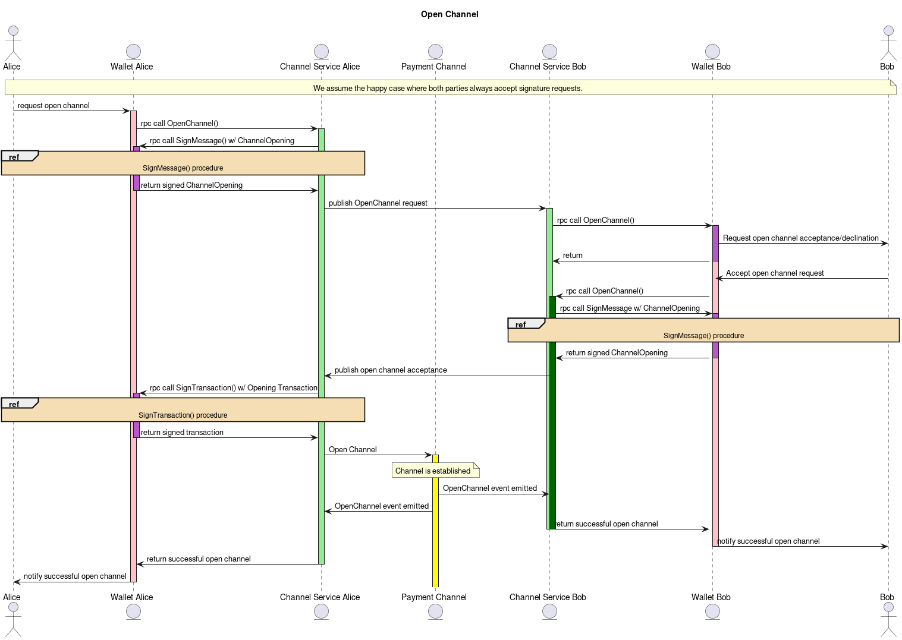

# Perun Wallet API Specification

The Perun wallet API specification describing the messages send and received
to/from a Perun wallet backend provider.

## Use-case

Any wallet wanting to integrate Perun channels should be able to rely on a
set specification describing **how** to interact with a Perun wallet backend.
The architecture is as follows:

### Channel-Wallet-Backend-Service
* How is it started?
  * Similar to Perun-CKB-Demo
  * Pubkey + Identifier:
    * Register while running
    * "List of demo-clients"

### Opening a channel
* Identify other channel users:
  * UserA knows identifier of UserB
  * A POV :=> Only knows identifier, wants to open channel
  * Backend POV :=> Receives identifier, somehow resolves to UserB
                    backend and opens.
  - Backend needs some kind of identifier resolving
  - Identifier { on-chain } -> Use LibP2P
    - Identifier implements `go-perun.wire.Address`
    - Relay, which is using some Resolver
    - Resolver can be either on-chain or off-chain server
    - on-chain: Address-book

* Opening a channel:
  * `OpenChannel(wire.Address, assets) -> (channelHandle)`

### Handling requests issued from wallet-service
* Service receives update event => Forwards to front-end
  - Front-end queries user event update agreement
* Service accepts/declines update depending on user decision
  - Accept :=> Service queries front-end for signature on new state
  - Decline :=> Wallet declines
* Signature Requests are decoupled from rest of workflow

### Signing & Sending on-chain transactions
* Service queries Wallet for assets to use.
* A: Service receives signed tx and sends itself
* B: Wallet sends signed tx and forwards necessary info to service

### go-perun/wallet-interface
* Neuron-Wallet:
  * Prompts users for signature requests
  * `func (a Account) SignData(data SignMessageMsg) ([]byte, error)`
  * `SignMessageMsg.Data.Display()` available to show front-end users what they are signing.

* Channel-Wallet-Service:
  * `VerifySignature(msg []byte, sig wallet.Sig, a wallet.Address) (bool, error)`
  * SignData calls back into (Neuron) wallet.

```
  .----------------.
  | Relay .----------.     .--- [on-chain address book]
  |       | Resolver |====-|
  |       ^----------^     ^--- [some off-chain storage]
  ^----------------^
```

## Architecture


## Communication

The communication between the channel service and the wallet integrating Perun
channels is defined in the following sequence diagram.

### Opening a channel


### Updating a channel


### Closing a channel


### Force closing a channel

