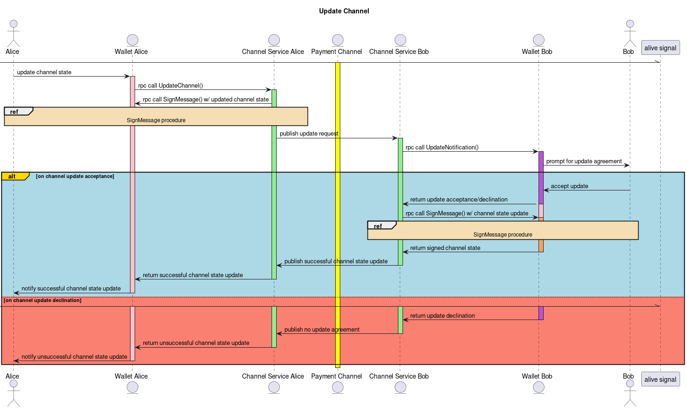

# Perun Wallet API Specification

The Perun wallet API specification describing the architecture and
corresponding messages used when interacting with Perun Payment Channels
integrated into a wallet.

## Integration

Protobuf descriptions for all here mentioned services are contained in [`./src/proto/perun-wallet.proto`](./src/proto/perun-wallet.proto).

For a primer on how to integrate Perun channels into your wallet, check out the
section [Integrating Perun payment channels](./README.md#integrating-perun-payment-channels)
in the README of this repository.

## Architecture

## Communication

The communication between the channel service and the wallet integrating Perun
channels is outlined using the following sequence diagrams.
The main purpose of the diagrams used here is to give concrete examples on
how the defined APIs interact with each other.

### Signing Messages
The channel service will need to sign possibly arbitrary messages related to
the state of a Perun channel. These messages have to be signed by the
participant.
Of course the wallet is free to handle the sign messages requests automatically
instead of propagating the request to the user.

The contents that are signed depend on the specific application context the
Perun channel is used in. Serialization of the message has to be handled on
the wallets side to avoid the situation where a user is signing arbitrary
byte-blobs.

### Signing Transactions
Over the lifetime of a Perun payment channel, specifically when opening,
challenging and withdrawing a channel, the channel service will have to submit
transactions on the participants behalf to the underlying ledger.

This requires the wallet to expose an endpoint for the channel service to sign
prebuilt transaction.

### Opening a channel
We assume the happy case where both parties want to open a channel.

### Updating a channel
Updating a channel might fail if the other party does not accept a proposed
state update.

### Closing a channel
Closing a channel might timeout if the other party does not cooperate. In that
case we enter the force-close channel sequence.

### Force closing a channel
Force closing a channel uses the ledger for settlement. This is the
uncooperative case where one party either does not care about closing a channel
or purposefully tried to force close a channel using a channel state that is
older than the actual channel state.

In any way, we will enter the challenge protocol, allowing other parties to
dispute the channel if necessary.

