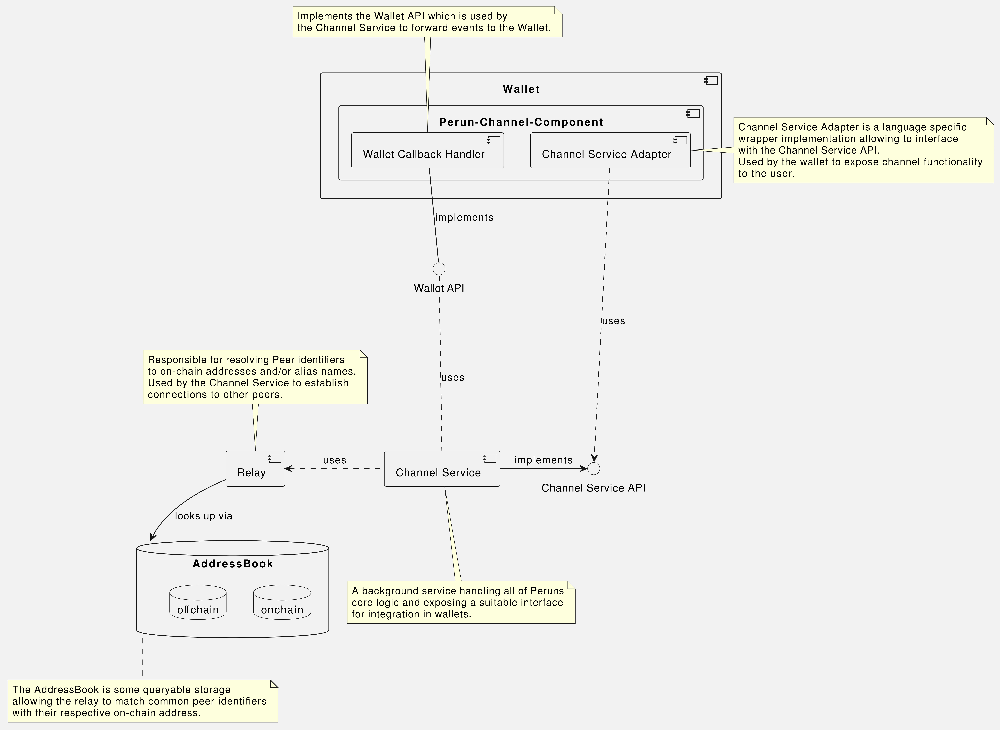
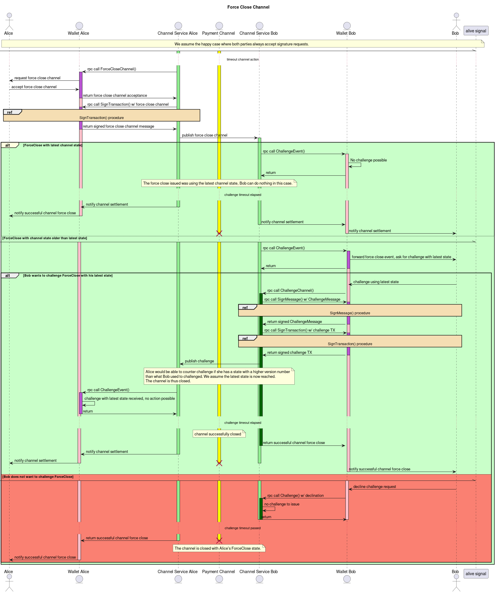

# Perun Wallet API Specification

The Perun wallet API specification describing the messages send and received
to/from a Perun wallet backend provider.

## Architecture

## Communication

The communication between the channel service and the wallet integrating Perun
channels is defined in the following sequence diagram.

### Signing Messages

### Signing Transactions

### Opening a channel

### Updating a channel

### Closing a channel

### Force closing a channel

